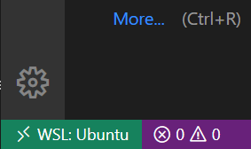

# AVRDUDE on Windows with WSL <!-- omit in toc -->

This guide to test and program the chip on Windows using WSL (Windows Subsystem for Windows) for embedded systems courses at UC Riverside.

If you are using a Windows machine, using WSL with VS Code is a good way to test your code and program your chip without using a virtual machine.

- [Prerequisites](#prerequisites)
- [Setup Basic Tools in WSL](#setup-basic-tools-in-wsl)
  - [Working Directory](#working-directory)
  - [Git](#git)
  - [VS Code](#vs-code)
- [Get AVR-ToolChain working on WSL](#get-avr-toolchain-working-on-wsl)
- [Getting AvrDude Working on WSL](#getting-avrdude-working-on-wsl)
- [Installing the correct driver for Atmel programming board](#installing-the-correct-driver-for-atmel-programming-board)
- [Bash Script for Saving Your Project](#bash-script-for-saving-your-project)

## Prerequisites

On your Windows machine, it should have these intalled:

1. WSL installed and initialized
    - Follow [this link](https://docs.microsoft.com/en-us/windows/wsl/install-win10) to install WSL on your machine, and [this link](https://docs.microsoft.com/en-us/windows/wsl/initialize-distro) to initialize it.
        - I recommand you use your name as the UNIX username, because the username will appear as the author in your lab files.
    - You can intall any distro you like, but this guide uses Ubuntu.

2. MinGW-x64
    - Download [here](https://sourceforge.net/projects/mingw-w64/files/Toolchains%20targetting%20Win32/Personal%20Builds/mingw-builds/installer/mingw-w64-install.exe/download) via SourceForge;

3. VS Code
    - Download [here](https://code.visualstudio.com/);

You should also have a GitHub account. You can signup [here](https://github.com/join).

**Now, open Linux Bash.**

---

## Setup Basic Tools in WSL

### Working Directory

1. In Windows, create a folder for your CS120B labs as your working direcory (wkdir), it should have **no space** in its dirctory;
    - Good example: "E:\Desktop\CS_120B\Labs", this directory will be used in all examples below.

2. To access this folder in WSL, do `

    ```bash
    # Command:
    $ cd /mnt/DRIVE_FLAG/FOLDER_DIR

    # For example:
    $ cd /mnt/e/Desktop/CS_120B/Labs
    ```

3. (Optional) To quickly access this folder, you can add an alias entry.

    ```bash
    # Command:
    $ alias alias_name="command_to_run"

    # For example:
    $ alias cs120blab="cd /mnt/e/Desktop/CS_120B/Labs"
    ```

    To make the alias entry permenent, add the command in `~/.bash_aliases` file (`~/.bashrc` if you are on other distros).

### Git

1. Setting your username and email in Git

    ```bash
    $ git config --global user.name "Your Name"
    $ git config --global user.email "your_email@example.com"
    ```

2. (Optional) Connecting to GitHub with SSH
    You don't have to use a SSH key to access GitHub, but I think it's easier this way. You can also skip this step if you have already done so.

    1. Check if you have ssh key or not

        ```bash
        $ ls -al ~/.ssh
        ```

        If prompt

        ```bash
        > ls: cannot access '/home/you/.ssh': No such file or directory
        ```

        Continue.

        If prompt

        ```bash
        > total 8
            ...
        ```

        Go to step 4.

    2. Create a SSH key in WSL
        Replace `your_email@example.com` with your email used in GitHub.

        ```bash
        $ ssh-keygen -t rsa -b 4096 -C "your_email@example.com"

        > Enter a file in which to save the key (/home/you/.ssh/id_rsa): [Press enter]

        > Enter passphrase (empty for no passphrase): [Type a passphrase]
        > Enter same passphrase again: [Type passphrase again]
        ```

    3. Add SSH key to the ssh-agent

        ```bash
        $ eval $(ssh-agent -s)
        > Agent pid 59566

        $ ssh-add ~/.ssh/id_rsa
        ```

    4. Add SSH key to GitHub account

        ```bash
        $ vim ~/.ssh/id_rsa.pub
        > ssh-rsa AAAAB3NzaC1yc2
            ...
            your_email@example.com
        ```

        Copy the printout.

        Follow [this guide](https://help.github.com/en/github/authenticating-to-github/adding-a-new-ssh-key-to-your-github-account) from step 2.

### VS Code

1. Install VS Code Server for x64

   ```bash
   $ code .
   > Installing VS Code Server for x64 (...)
   ```

2. Allow firewall connection

3. Install VS Code "Remote - WSL" extention
   - Should install automatically.

4. On the bottom-left conner, a green icon should appear saying `WSL: your distro`.
        

---

## Get AVR-ToolChain working on WSL

1. Install basic components

   ```bash
   $ sudo apt-get cmake make zlib1g zlib1g-dev
   ```

2. Install simAVR
    1. Install by `apt-get`:

        ```bash
        $ sudo apt-get install simavr
        ```

    2. Install by `git clone`

        ```bash
        # Clone it to your home dir
        $ cd ~
        $ git clone git@github.com:buserror/simavr.git

        # If you are using https, do this instead
        $ git clone https://github.com/buserror/simavr.git
        ```

    - Note: You need to install simAVR in both ways.
      - `apt-get` gives you access to bash command `simavr`,
      - `git clone` gives the MakeFile access to the installation directory which we will use later.

3. Install AVR-GCC Toolchain

    ```bash
    $ sudo apt-get install gcc-avr binutils-avr avr-libc gdb-avr
    ```

    - You can skip step 3 and onward in the AVR-GCC Toolchain installation guide since we are  using avrdude in Windows instead of WSL.

4. Clone UCRCS120B_AVRTools to your wkdir;

    ```bash
    $ git clone git@github.com:jmcda001/UCRCS120B_AVRTools.git

    # If you are using https, do this instead
    $ git clone https://github.com/jmcda001/UCRCS120B_AVRTools.git
    ```

5. Edit the MakefileTemplate
    In `UCRCS120B_AVRTools/templates/MakefileTemplate` file, edit line 14 to be the path to your SimAVR installation.

    ```makefile
    # Edit this
    SIMAVRDIR=SET YOUR SIMAVR DIRECTORY HERE

    # To this
    SIMAVRDIR=/home/$(USER)/simavr/simavr/
    ```

6. Edit createProject.sh
    In `UCRCS120B_AVRTools/createProject.sh` file, edit line 76 to be the relative path from your SIMAVRDIR to the avr_mcu_section.h file.

    ```cpp
    // Edit this
    #include "include/simavr/avr/avr_mcu_section.h"

    // To this
    #include "/home/${USER}/simavr/simavr/sim/avr/avr_mcu_section.h"
    ```

7. Customize createProject.sh (optional)
    Replace line 114 to 121 with the following code to initialize the directory to a GitHub repo.

    ```bash
    echo -e "Initialize the directory to a GitHub repo."
    read -p 'git repo link [press ENTER to skip]: ' link

    if [ -n "$link" ]
    then
        echo -e 'Initializing repo...'
        cd "$name"
        git init
        git add .
        git commit -m 'Initializing repository'

        echo -e 'Adding repo to GitHub...'
        git remote add origin "$link"
        git remote -v

        echo -e 'Pushing changes to GitHub...'
        git push -u origin master

        echo
        echo -e "\e[42mProject Pushed.\033[0m You can change your directory and continue working."
    else
        echo -e "\e[104mProject not initialized.\033[0m You can change your directory and continue working."
    fi
    ```

---

## Getting AvrDude Working on WSL

**In WSL:**
You need to use avrdude.exe in Windows to program your chip, since WSL does not support libusb devices (such as the Atmel board when using avrdude).

1. Download avrdude on [official website](https://www.nongnu.org/avrdude/);
    - Download area click [HERE](https://download.savannah.gnu.org/releases/avrdude/?C=M&O=D)
    - Select mingw32 version, file name should look like `avrdude-*.*-mingw32.zip`.

2. Unzip and put it in a folder which dirctory has **no space**;

3. Change `UCRCS120B_AVRTools/templates/MakeFileTemplate` line 37 to `avrdude.exe`'s directory.
    If avrdude.exe is in `E:\Desktop\CS_120B\avrdude-6.3`

    ```bash
    # Edit this
    PROGRAM=avrdude

    # To this
    PROGRAM=/mnt/e/Desktop/CS_120B/avrdude-6.3/avrdude.exe
    ```

4. If you are having error `avrdude.exe: jtag3_open_common(): Did not find any device matching VID 0x03eb and PID list: 0x2141`, go to [this section](#installing-the-correct-driver-for-atmel-programming-board).

---

## Installing the correct driver for Atmel programming board

If you are having error **in Windows**, `avrdude.exe: jtag3_open_common(): Did not find any device matching VID 0x03eb and PID list: 0x2141` in avrdude(ss), follow steps below.
If you are having a similar error in WSL like `avrdude: jtag3_open_common(): Did not find any device matching VID 0x03eb and PID list: 0x2141`, you should go to [this part](#getting-avrdude-working-on-wsl).

1. Download Zadig from its [official website](https://zadig.akeo.ie/);

2. Connect the board to your computer;

3. Open `zadig.exe`;

4. In the dropdown list, select "Atmel-IEC ****";
    - Might have 2-3 devices start with "Atmel-IEC", repeat on all of them
    - If you don't see it, select "List All Devices" in "Option" menu

5. Check USB ID, should be 03EB 2141 (might have 01 or 02 in the third box);

6. Select "libusb-win32" as the driver to be installed;

7. Click "Install Driver" or "Replace Driver".

8. In Device Manager, the board should be under "libusb-win32 Devices"

---

## Bash Script for Saving Your Project

Change line 4 to put your UCR Net ID between the quatation marks.

```bash
#!/bin/bash
SCRIPTDIR="$( cd "$( dirname "${BASH_SOURCE[0]}" )" > /dev/null 2>&1 && pwd )"
RED_TEXT="\e[31m"
CLR_FORMAT="\e[0m"
NET_ID="Your_Net_ID_Here"

echo 'Saving lab files.'
read -p 'Lab number: ' lab
read -p 'Lab part #: ' part
read -p 'Is this the last part [Y,n] ? ' last
echo -e 'Saving...'

if [ -z "$lab" ] 
then
    echo -e "${RED_TEXT}Must have a lab number.${CLR_FORMAT}";
    exit 1;
fi

if [ -z "$part" ] 
then
    echo -e "${RED_TEXT}Must have a part number.${CLR_FORMAT}";
    exit 1;
fi

echo 'Copying current files to turnin...';
cp source/main.c turnin/${NET_ID}_lab"$lab"_part"$part".c
cp test/tests.gdb turnin/${NET_ID}_lab"$lab"_part"$part"_tests.gdb
echo 'Done.'
echo

echo 'Saving to GitHub...'
git add turnin/ .
git commit -m '"Completed part '"$part"'"'
git status
git push
echo 'Done.'
echo

if [ $last = Y ] || [ $last = y ]
then
    echo 'Creating turnin.zip...'
    cd turnin
    zip ../turnin *
    echo -e "\e[42mDone.${CLR_FORMAT}"
fi

```